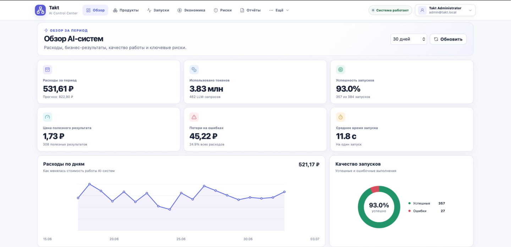

# Hi, I'm Ilya 👋

Applied Mathematics student at NUST MISIS, focused on Data Science and Machine Learning.

I build end-to-end ML projects — from data validation and leakage-safe evaluation to modeling, interpretation and deployment. My current focus is tabular ML, NLP and practical ML systems.

I am looking for a Data Science or Machine Learning internship or junior position.

## Skills & Tools

### Machine Learning & Data

  
  
  
  
  
  
  

### Engineering

  
  
  
  
  

## Featured Projects

### [ROGII — Wellbore Geology Prediction](https://github.com/novaeKH/rogii-wellbore-prediction)

Regression project for predicting TVT along hidden segments of horizontal well trajectories.

- Designed leakage-safe validation by complete wells, with a separate spatial guardrail for geographic shift.
- Engineered 32 fold-safe spatial features by reconstructing six geological surfaces with IDW interpolation.
- Combined four CatBoost regressors with distance-aware fallback and boundary correction.
- Improved Public Leaderboard RMSE from **13.608** to **11.670** — a **14.2%** reduction.

`Python` `Pandas` `CatBoost` `Feature Engineering` `Group CV` `Spatial Validation`

---

### [Bank Marketing Prioritization](https://github.com/novaeKH/bank-marketing-prioritization)

Binary classification and ranking project for prioritizing clients under a 10% outbound-call budget.

- Removed post-call data leakage and used temporal folds to evaluate performance on future campaigns.
- Compared linear and tree-based models, selecting Logistic Regression for its stability across time.
- Achieved **AP 0.530**, **ROC-AUC 0.745** and **Lift@10% 1.91** on the final period.
- Explained the ranking with permutation importance and model coefficients.

`Python` `Pandas` `Scikit-learn` `Temporal Validation` `Ranking Metrics` `Model Interpretation`

---

### [Banking Intent Classifier](https://github.com/novaeKH/banking-intent-classifier)

Multiclass NLP project for routing customer requests across 77 banking intents.

- Built a shared leakage-safe evaluation pipeline with fixed splits and macro F1.
- Compared TF-IDF with Logistic Regression, a custom Transformer Encoder implemented in PyTorch and fine-tuned DistilBERT.
- DistilBERT reached **0.882 validation macro F1** and **0.886 official test macro F1**; TF-IDF remained a strong baseline at **0.861**.

`Python` `Scikit-learn` `PyTorch` `NLP` `Transformers` `DistilBERT`

---

### [StoryWeaver — 126M Story Generation Model](https://github.com/novaeKH/StoryWeaver)

GPT-style language model trained from scratch for controllable short-story generation.

- Implemented a 126M-parameter decoder-only Transformer in PyTorch with RoPE, GQA, RMSNorm, SwiGLU and KV cache.
- Built the byte-level BPE tokenizer, data pipeline and mixed-precision training loop with gradient accumulation, validation and checkpointing.
- Added a FastAPI web application for steering generation with a summary, required words, story opening and narrative features.

  

`Python` `PyTorch` `Transformer` `Tokenizers` `FastAPI` `Generative NLP`

---

### [Takt AI Control Center](https://github.com/novaeKH/takt-ai-control-center)

AI Observability, FinOps and Governance platform for operating AI products and agents.

- Built an AI registry and telemetry pipeline for agent runs, LLM calls, tool calls and business outcomes.
- Implemented token-cost accounting, budgets, ROI and waste metrics, policy violations, audit history and role-based access.
- Exposed a REST ingestion API and Python SDK, with FastAPI, PostgreSQL, Redis and React services packaged through Docker Compose.

  

`FastAPI` `PostgreSQL` `Redis` `React` `Docker Compose` `REST API`
